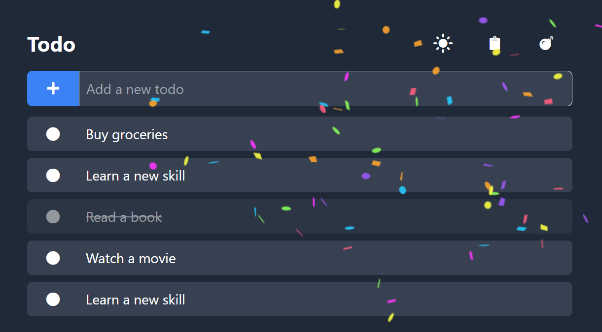

# Todo App

A simple Todo application built with Vue.js and Tailwind CSS.



## Prerequisites

Before you begin, ensure you have the following installed on your system:

- [Node.js](https://nodejs.org/) (version 16 or higher recommended)
- [npm](https://www.npmjs.com/) (comes with Node.js)

## Getting Started

Follow these steps to set up and run the project locally:

### 1. Install Dependencies

Run the following command to install the required dependencies:

```bash
npm install
```

### 2. Run the Development Server

Start the development server with:

```bash
npm run dev
```

This will start a local development server. Open your browser and navigate to the URL provided in the terminal (e.g., `http://localhost:3000`).

### 3. Build Tailwind CSS (Optional)

If you make changes to the Tailwind CSS configuration or styles, you can rebuild the CSS file with:

```bash
npm run build:css
```

### 4. Build for Production

To create an optimized production build, run:

```bash
npm run build
```

The build output will be available in the `dist/` directory.

### 5. Preview the Production Build (Optional)

To preview the production build locally, run:

```bash
npm run preview
```

This will serve the files from the `dist/` directory.

## Features

- Add, edit, and delete todos
- Toggle dark mode
- Copy todos to the clipboard in Markdown format
- Add random todos
- Confetti effect when deleting todos

## Project Structure

```
todo-app/
├── src/
│   ├── App.vue         # Main Vue component
│   ├── main.js         # Entry point for the Vue app
│   ├── utils.js        # Utility functions
│   ├── tailwind.css    # Tailwind CSS input file
├── dist/               # Build output (ignored by Git)
├── index.html          # Main HTML file
├── tailwind.config.js  # Tailwind CSS configuration
├── package.json        # Project metadata and scripts
├── .gitignore          # Git ignore rules
└── README.md           # Project documentation
```

## License

This project is licensed under the [MIT License](LICENSE).

## Acknowledgments

- [Vue.js](https://vuejs.org/)
- [Tailwind CSS](https://tailwindcss.com/)
- [Canvas Confetti](https://confetti.js.org/more.html)
- [Font Awesome](https://fontawesome.com/) for icons